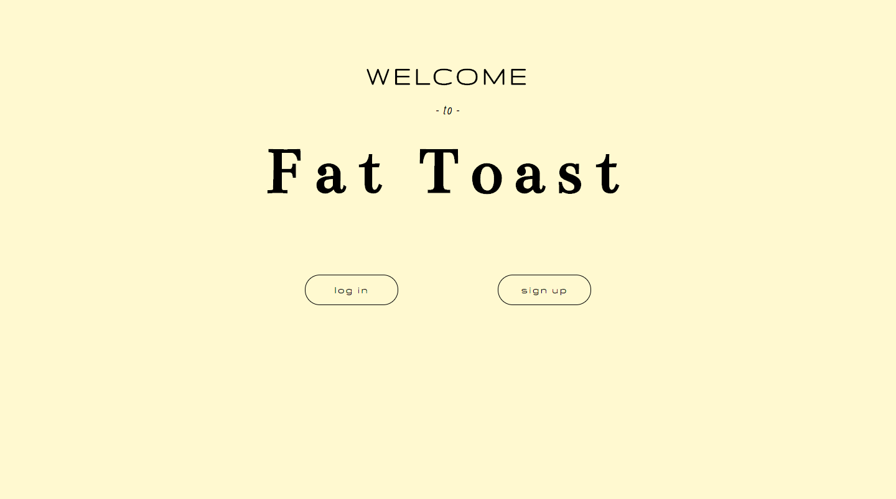
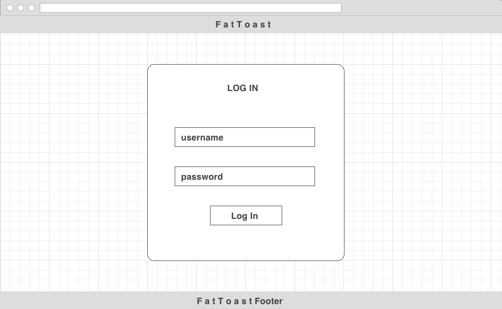
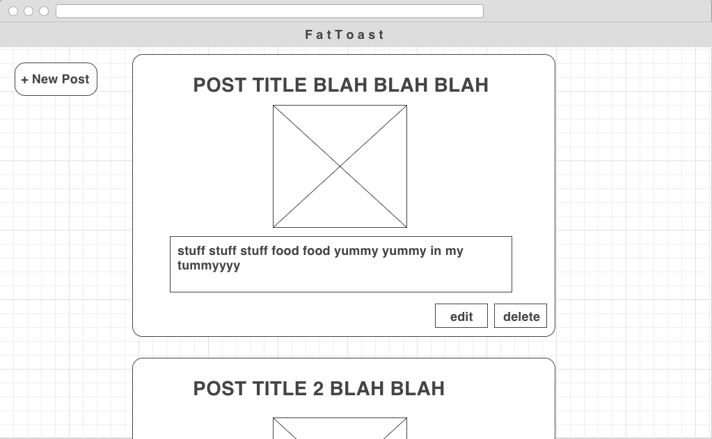
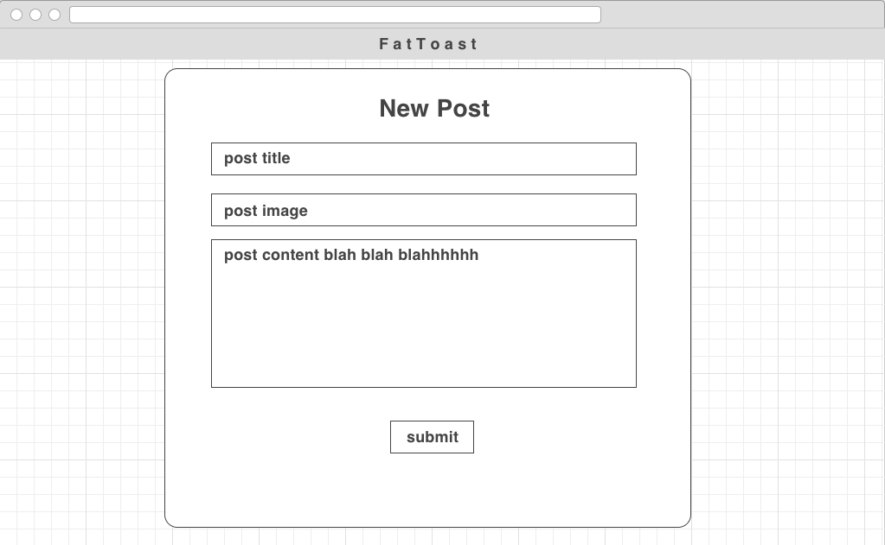

# project4
##F A T  T O A S T

login / sign up page

main page 

make a new post

#Tech:
* HTML/CSS
* JavaScript
* Node.js
* Express.js
* React.js
* React Router
* PSQL

#User Story:
FAT TOAST is a site for foodies. User can sign up / log in, and create new posts with pictures of their favorite food.

#Challenges:
React Router
C.R.U.D.

Credits:
♡ Thanks for the help: ♡
Sang / Alex / Donald / Andrew

References:
https://github.com/reactjs/react-router-tutorial/tree/master/lessons/04-nested-routes
https://www.gradient-animator.com/
puppies
